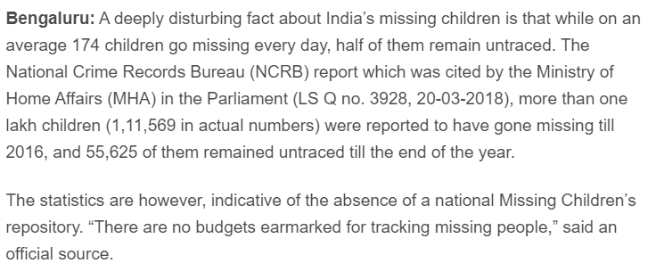
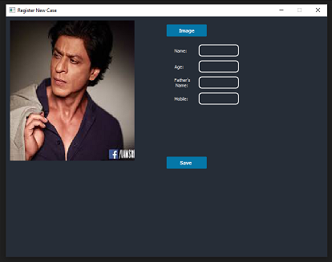
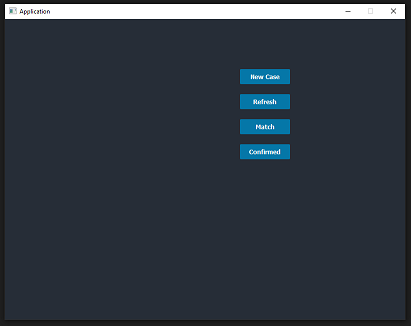

# Find Missing Person using AI
   


Hundreds of people (especially children go missing every day) in India. There are various <b>NGO's and Govt Initiatives</b> to help with it. This project tries to implement an  existing/new way to help.

## List of contents
- ### [News Articles](#news-articles)
- ### [Objective](#what-is-the-objective-of-this-project-and-how-will-it-help)
- ### [Solution](#solution-projects-implementation)
- ### [Installation](#how-to-run)
- ### [What is left/not working?](#what-is-left)

## News Articles
#### [Article 1](https://www.thehindu.com/society/indias-missing-children-what-the-whatsapp-rumours-dont-tell-you/article24641527.ece)

#### [Article 2](https://www.deccanchronicle.com/nation/current-affairs/250518/indias-children-174-go-missing-every-day-half-untraced.html)



## What is the objective of this Project and how will it help?
The objective of this project is to help Police and higher authorities to track down missing people quickly. The usual process to track a person is using investigation which requires time and experience (to ask right questions). Most of the time, investigation method works pretty well but it is time consuming and can be unsuccessful if the person (missing) has been shifted/moved to different location (city/country).<br>
In such cases, the ideal approach is to go through CCTV footages and evidences. Again, this can be very time consuming and given the number of people that go missing everyday, it can be a challanage to keep up with it.<br>

## Solution (Project's Implementation)
### 1. Registering New Cases
The first step is to register a new case. The GUI application is built using <b>PyQT5</b> that allows you to collect all relevant information and store it in database <b>Postgres</b>.
> Please ignore the SRK's image. It is just for the sake of project :)



### 2. Waiting for Users to submit images
So far we have only talked about 'how new cases will be registered', the next thing we have to do is to match these registered cases but who do we match it with? This is where ours Users come in. These users are common people like you and me who wants to make a change in the society.<br>
The common people will use an application on their mobile to submit photos of people who they think have lost or found begging while keeping them their identity anonymous. The anonymous part is very important because they fear of local <i>Gundas</i> that might create trouble for them.<br>
> Mobile Application


> An android Application can also be build and used but I have very little experience in it.
### 3. Matching Cases
The next step is to match the case images and user submitted images. To match <b>KNN Algorithm </b> is used.


## How to run
#### 1. With Docker (Easy)
Prerequisites
```
Docker (docker-compose as well)
```
```
$ git clone https://github.com/gaganmanku96/Finding-missing-person-using-AI
$ cd Finding-missing-person-using-AI
$ docker-compose up --build
$ cd app
$ pip install -r requirements.txt --no-cache-dir
$ python login_window.py
```
At this point you'll see a window like this


> Default username: admin
> Default password: admin
> 
> Login window makes sure that only authenticated can view the registered cases. Each user can only view the cases submitted by him.
> NOTE: There is no concpet of superuser.

After logging in you'll see the main screen through which you'll be able to submit cases.

##### To run the mobile application:
```
$ cd mobile_app
```
or (if you are inside app dir) 
```
$ ../mobile_app
```
```
$ python ui.py
```
After that you'll see a window like this<br>


You can this to submit user images or you can create your own mobile app.

Once done you'll have to <b>Click on Refresh</b> button on train KNN Model and then on <b>Match</b> to start Matching Images.

#### 2. Without Docker (Intermediate)
Here are the step you have to do
1. Install Postgres Database and replace the username and password in config/.env.file
2. The next step is to run database and make sure it is working.
```
$ cd database
$ pip install -r requirements.txt
$ uvicorn main:app --port 8002
```
3. Next, the face encoding api
```
$ cd face_encoding
$ pip install -r requirements.txt
$ uvicorn main:app --port 8000
```
> If you are using non-conda environment like venv then it might give error while installing dlib library.
4. Running  the application
```
$ cd app
$ pip install -r requirements.txt
$ python login.py
```
At this point you'll see a window like this


> Default username: admin
> Default password: admin
> 
> Login window makes sure that only authenticated can view the registered cases. Each user can only view the cases submitted by him.
> NOTE: There is no concpet of superuser.

After logging in you'll see the main screen through which you'll be able to submit cases.

##### To run the mobile application:
```
$ cd mobile_app
```
or (if you are inside app dir) 
```
$ ../mobile_app
```
```
$ python ui.py
```
After that you'll see a window like this<br>


You can this to submit user images or you can create your own mobile app.

Once done you'll have to <b>Click on Refresh</b> button on train KNN Model and then on <b>Match</b> to start Matching Images.


## What is left?
 - [x] Login (Authentication)
 - [x] Submit new case
 - [x] Mobile Application (to submit user photos)
 - [ ] View submitted cases
 - [ ] View confirmed cases
 - [ ] Unit tests

## Vote of Thanks
- Thanks to [Davis King](https://github.com/davisking) for creating dlib and for providing the trained facial feature
  detection and face encoding models used in this project.
